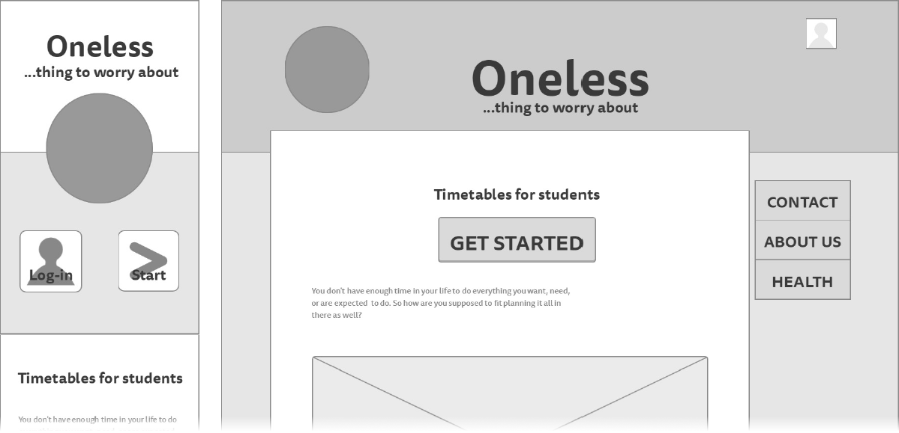

# Documentation
Documentation for Web Technologies (Lvl 4) - Assessment 1

Kieron Gillingham\
Southampton Solent University - 2019

---

## Contents
- The problem to be solved
- Wireframe of design
- Colour scheme choice and justification
- Accessability considerations
- GDPR and legal requirements
- An evaluation of the completed application and process

---

## Background
There are many students who struggle with balancing their workload and keeping organised. This application aims to provide a system to help students manage their time effectively.

The principal idea is to analyse a students timetable and calculate how much independent study needs to be done for each unit/project. The application would then integrate with the Google calender API to create a weekly timetable for the student.

---

## Wireframes
Before beginning production of the website, I used an online tool called [Mockingbird](https://gomockingbird.com/) to create wireframes of the main pages.
The full wireframes can be found [here](wireframes.pdf).

*Note: The wireframes were created before the name of the project was finalized.*

---

## Colour Palette and Design
I selected the following colour palette to be evocative of a desktop daily planner. The muted browns are sharply contrasted by the bright accents, similar to what would be seen in a highlighted notebook.

The navigation pane is styled to look like notebook tabs. The users location is shown by offseting the position of the tab refering to the current page.

---

## Accessability
TBC

---

## Legal Considerations
The application is not a paid service and does not sell products. It does however, make use of the google sign-in api, which requires user consent and a suitable privacy policy regarding the handling of user data.

A link to the privacy policy is located in the footer of each page.

---

## Evaluation
- I struggled during the design phase

I decided to design the website from a mobile-first approach as modern students are more likely to access it from a phone.

I used JavaScript to dynamically insert shared elements into different pages. Although this is not the cleanest method of creating shared elements, it did not require importing any unecessary frameworks or tools.