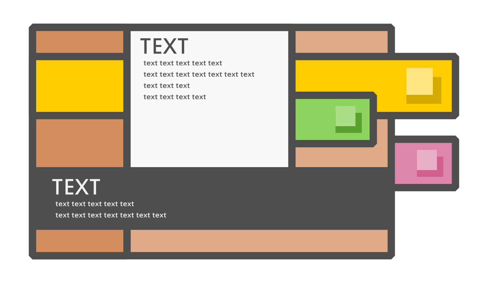

# Documentation
Documentation for Assessment 1

Will include:
- The problem to be solved
- Wireframe of design
- Colour scheme choice and justification
- Accessability considerations
- GDPR and legal requirements
- An evaluation of the completed application and process

## Background
There are many students who struggle with balancing their workload and keeping organised. This application aims to provide a system to help students manage their time effectively.

## Wireframes
TBC

## Colour Palette

## Accessability
TBC

## Legal Considerations
- The application is not a paid service and does not sell products.

## Evaluation
- I struggled during the design phase
- Justify decision to develop mobile first
