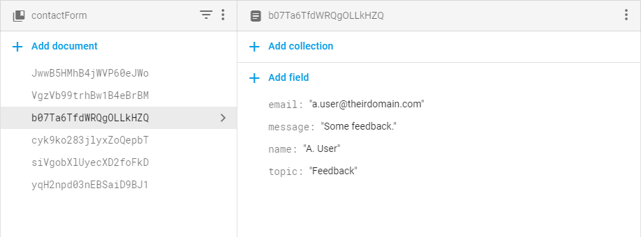

# Documentation
Documentation for Web Technologies (Lvl 4) - Assessment 1

Kieron Gillingham\
Southampton Solent University - 2019

---

## Contents
1. [Background](#Background)
2. [Wireframes](#Wireframes)
3. [Design&nbsp;and&nbsp;Colour&nbsp;Palette](#Design&nbsp;and&nbsp;Colour&nbsp;Palette)
4. [Accessibility](#Accessibility)
5. [Legal&nbsp;Considerations](#Legal&nbsp;Considerations)
6. [Evaluation](#Evaluation)

---

## Background
There are many students who struggle with balancing their workload and keeping organised. This application aims to provide a system to help students manage their time effectively.

The principal idea is to analyse a student's timetable and calculate how much independent study needs to be done for each unit/project. The application would then integrate with the Google Calendar API to create a weekly timetable for the student around their current commitments.

---

## Wireframes
Before beginning production of the website, I used an online tool called [Mockingbird](https://gomockingbird.com/) to create wireframes of the main pages.
The full wireframes can be found [here](wireframes.pdf).

*Note: The wireframes were created before the name of the project was finalized.*

---

## Design and Colour Palette
I selected the following colour palette to be evocative of a desktop daily planner. The muted browns are sharply contrasted by the bright accents, similar to what would be seen in a highlighted notebook.

The navigation pane is styled to look like notebook tabs. The user's location is shown by offsetting the position of the tab referring to the current page.

The background image is a corkboard to match the theme of office stationary while fitting the chosen colour palette. It is a free-for-non-commercial-use image obtained from [here](https://www.publicdomainpictures.net/en/view-image.php?image=25664&picture=cork-board).

---

## Accessibility
To facilitate keyboard users, each page includes a skip-to-content link hidden off-screen until it is given focus.

Important images have appropriate alt-text. Images that are simply styling for buttons have empty alt-text fields to indicate that they can be ignored. Images that function as links have been given titles to describe their purpose.

All pages have appropriate titles. The name of the website comes after the title of each page for the benefit of screen readers.

---

## Legal Considerations
The application is not a paid service and does not sell products, so there are no legal concerns regarding safe e-commerce. The website does, however, make use of Google authentication and the Google Calendar API to access user data, which requires the consent of the user.

Before a user can sign-in, they must tick a checkbox that confirms their acknowledgement of the terms and conditions found [here](deployment/legal.html). When they sign-in through Google, they are automatically prompted to give access rights to their basic profile and calendar.

Links to the legal statements are located in the navigation and footer of each page.

---

## Evaluation
I decided to design the website from a mobile-first approach as modern students are more likely to access it from a phone. The desktop view is designed around a column as it made translating from the mobile view simpler.

I used JavaScript to dynamically insert shared elements into different pages. Although this is not the cleanest method of creating shared elements, it did not require importing any unnecessary frameworks or tools.

Through JavaScript, I disabled navigational links to the current page as this would be confusing to the user. This applies to mouse-overs and keyboard navigation.

Regrettably, I was unable to embed user timetables directly into the site. The Google Calendar API does not offer great support for the display of end-user calendars, although specific calendars can be inserted. I instead created a dynamic table that roughly mimics a weekly calendar by colouring cells according to the user's stored events.

Form data is sent to Google Firestore. Currently, there is no method for linking records in each collection together, or associating them with the Google account of the signed in user.

The Terms of Use and Privacy Policy documents are not guaranteed to be legally binding or fit for use. While an attempt has been made to cover required statutes such as GDPR; creating valid legal documentation requires specialist knowledge that is beyond the scope of this course. Likewise, design has been of lower priority than the technical implementation of web standards.

The name "Tourbill" is derived from "Tourbillon": a watch component that balances out errors. This is reflected by the gear in the main logo. I felt this was appropriate as the website is focused on time-management.

This website has been produced using Git version control and has been stored on [GitHub](https://github.com/KieronGillingham/CDA404-Assessment).

Google Firebase is used for data-storage and hosting. The site is hosted [here](https://tourbill.firebaseapp.com/).